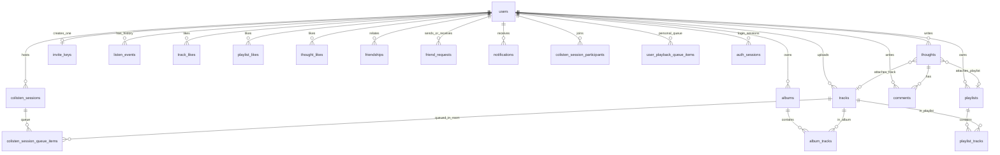

# Выравнивание бэкенда под клиент MiMusic

**Источник правды:** продуктовая логика клиента и ваше описание домена. Бэкенд `mimusicback-master` дорабатывается под эту модель; Flutter-приложение подключается к API.

**Локальный контекст клиента:** `MiMusic/project-context.local.md` (не в git).

**Порядок внедрения по этапам:** `md/IMPLEMENTATION_ROADMAP.md`.

---

## Статус артефактов

- **Схема БД и стартовый SQL-скрипт — готовы** (таблицы, PK/FK, согласованы с этим документом). В репозитории бэкенда скрипт хранится как **`mimusicback-master/db/schema/pgsql_starter_code.sql`** (при переносе файла обновите путь здесь и в README бэка). В скрипте у таблицы **`tracks`** добавлено поле **`duration_ms`** (длительность для API и сканера).
- **Exposed/Ktor** для уже реализованных маршрутов приведены к этому DDL (имена таблиц/колонок как в PostgreSQL). **Инструмент миграций (Flyway/Liquibase) на текущем этапе не используется** — схема накатывается этим скриптом на **чистую** БД; перенос со старых таблиц не планируется.
- **Регистрация и вход** против живого API проверены (включая ошибки сети и ответы 400/401/409); в БД при первом старте появляются служебные пользователи **`__scanner_uploader__`** (сканер треков) и **`__invite_key_holder__`** (владелец сидированного тестового invite), плюс активный ключ **`TESTK-EYDEV-BUILD`** в **`invite_keys`** — см. `DatabaseBootstrap.kt`.
- **Загрузки и раздача файлов:** multipart-эндпоинты для трека, обложек (трек / плейлист / альбом) и аватара; лимиты размера и обработка изображений — см. этап 3 в `IMPLEMENTATION_ROADMAP.md`. Раздача через **`FileServingRouting`** и привязанные **`GET`** (стрим трека, обложки, аватар).
- **Каталог треков:** **`GET /tracks`** отдаёт JSON для клиента (лимит, порядок); стрим **`GET /tracks/{id}/stream`** — **`Accept-Ranges: bytes`**, один интервал **`Range: bytes=…`** (**`206`** + **`Content-Range`**), без `Range` — целый файл (**`200`**), невыполнимый range — **`416`**, multipart — **`400`**, срез > 64 MiB — **`413`**. Реализация: **`features/tracks/TrackRangeRespond.kt`** (вызов из **`TrackRouting.kt`**); без JAR **`ktor-server-partial-content`** (проверено: curl и приложение).
- **Git:** удалённый репозиторий ведёт **`master`** и **`main`** на одном актуальном коммите (ветки слиты).
- Когда появится потребность в версионируемых DDL на нескольких средах, имеет смысл снова ввести миграции — см. этап 1 в `md/IMPLEMENTATION_ROADMAP.md`.

### PostgreSQL: где «файл базы» и как смотреть таблицы (аналог DB Browser for SQLite)

У **SQLite** одна база часто — один файл `.db` / `.sqlite`, который удобно открыть в **DB Browser for SQLite**.

У **PostgreSQL** нет такого одного «файла приложения» со всей базой: данные лежат в **каталоге данных кластера** (data directory), который задаётся при инициализации сервера (на Windows — обычно внутри установки PostgreSQL, на Linux — типично `/var/lib/postgresql/...`). Точный путь в работающем сервере: выполнить в **`psql`** команду SQL `SHOW data_directory;` (нужны права суперпользователя или соответствующая роль). Внутри — служебная структура кластера; **открывать этот каталог как файл в DB Browser не получится** — это не формат одного файла-БД.

**Просматривать таблицы и данные** нужно клиентом для Postgres: **pgAdmin 4**, **DBeaver**, **DataGrip**, **Azure Data Studio** (с драйвером PostgreSQL), веб-**Adminer** или консоль **`psql`**. Параметры подключения — те же, что для бэка: хост, порт, имя БД, пользователь, пароль (как в `DB_*` / `mimusicback-master/.env.example`).

---

## 0. Загрузки на сервер и файловое хранилище

**Правило:** треки, альбомы и плейлисты пользователь **создаёт через загрузку на сервер** (multipart / отдельные эндпоинты). Сервер принимает файлы, валидирует и обрабатывает метаданные, **аудио** сохраняет в **`music_storage/`**. Обложки и аватары — в отдельных каталогах **`file_storage/`** (не смешивать с аудио). В БД хранятся **относительные ключи/пути** к файлу внутри этих корней (или UUID-имена файлов), а не бинарники в таблицах.

**Структура каталогов в репозитории** (`mimusicback-master/`, уже создана, в git только `.gitkeep`):

| Каталог | Назначение |
|---------|------------|
| `music_storage/` | Аудиофайлы треков (как у существующего `MusicScanner` + пользовательские загрузки). |
| `file_storage/avatars/` | Аватары пользователей. |
| `file_storage/covers/tracks/` | Обложки треков (если не встроены в файл / отдельная загрузка). |
| `file_storage/covers/playlists/` | Обложки плейлистов. |
| `file_storage/covers/albums/` | Обложки альбомов. |

В **Docker** эти пути монтируются как **volume** на хост, чтобы данные переживали пересборку образа. Корни каталогов задаются через **env** (`MUSIC_STORAGE_DIR`, `FILE_STORAGE_ROOT`) — в **`mimusicback-master`** это уже читается при старте (`config/Environment.kt`); для деплоя остаётся описать **Compose** и те же имена переменных в сервисе.

---

## 1. Целевая модель данных (основные таблицы и связи)

Ниже — **основные** сущности, которые вы задали, плюс **необходимые связующие таблицы** (без них запросы «лайки», «состав плейлиста», «друзья» не выразить в реляционной БД нормально).

### 1.1. Пользователь (`users`)

| Поле (ориентир) | Назначение |
|-----------------|------------|
| `id` | PK |
| `email` | Уникальный логин |
| `password_hash` | Хэш (argon2/bcrypt), не plain text |
| `nickname` | Отображаемое имя, уникальность — по правилам продукта |
| `avatar_url` / `avatar_storage_key` | Профиль; файл в **`file_storage/avatars/`** |
| `bio` (опционально) | Текст профиля |
| `created_at`, `updated_at` | Аудит |

**Связи исходящие:** владеет треками (как автор публикации), альбомами, плейлистами, мыслями, комментариями; участвует в дружбе, лайках, комнатах, истории прослушиваний; имеет не более **одного созданного инвайт-ключа** (см. п. 1.8).

---

### 1.2. Трек (`tracks`)

Единая **медиатека приложения**: любой авторизованный пользователь может **воспроизвести** любой трек и добавить его в **избранное (лайк)** и/или в **любой свой плейлист**. При этом у трека есть **владелец публикации** (`uploader_user_id`) — тот, кто «выложил» файл; в профиле другого пользователя показываются **все треки, где он uploader**.

| Поле (ориентир) | Назначение |
|-----------------|------------|
| `id` | PK |
| `uploader_user_id` | FK → `users.id` (обязателен, если все треки пользовательские; если допускается «системный» каталог платформы — допускается `NULL` и отдельный флаг `source`) |
| `title`, `artist`, `duration_ms` | Метаданные |
| `audio_storage_key` / относительный путь | Файл в **`music_storage/`** после загрузки и обработки на сервере |
| `cover_storage_key` (опционально) | Обложка в **`file_storage/covers/tracks/`** (или встроенная в аудио — по реализации) |
| `hash` (опционально) | Дедупликация / целостность |
| `created_at`, `updated_at` | |

**Связи:**

- **M:N с плейлистами** через `playlist_tracks` (см. ниже).
- **M:N «лайк трека»** через `track_likes` (`user_id`, `track_id`, уникальная пара).
- **M:N с альбомами** через `album_tracks` (упорядоченный состав альбома).
- Может быть прикреплён к **мысли** (см. `thoughts`).
- Попадает в **историю прослушиваний** и в состояние **комнаты** как текущий трек.

---

### 1.3. Альбом (`albums`)

Пользовательские альбомы (аналог «студии»): принадлежат пользователю, содержат упорядоченный набор треков.

| Поле (ориентир) | Назначение |
|-----------------|------------|
| `id` | PK |
| `owner_user_id` | FK → `users.id` |
| `title`, `artist_display` (опционально) | |
| `cover_storage_key` (опционально) | Обложка в **`file_storage/covers/albums/`** |
| `created_at`, `updated_at` | |

**Связь с треками:** треки в составе альбома — это записи в **`tracks`**, загруженные на сервер; связь через **`album_tracks`** (`album_id`, `track_id`, `position` INT, уникальность `(album_id, position)` и `(album_id, track_id)` по правилам продукта).

---

### 1.4. Плейлист (`playlists`)

| Поле (ориентир) | Назначение |
|-----------------|------------|
| `id` | PK |
| `owner_user_id` | FK → `users.id` |
| `title` | |
| `is_public` | Если `true` — виден другим, может участвовать в рекомендациях |
| `cover_storage_key` (опционально) | Обложка в **`file_storage/covers/playlists/`** |
| `likes_count` (опционально, денорм.) | Кэш для сортировки в рекомендациях; источник правды — `playlist_likes` |
| `created_at`, `updated_at` | |

**Состав:** **`playlist_tracks`** (`playlist_id`, `track_id`, `position`).

**Лайки плейлиста (и «кто лайкнул»):** **`playlist_likes`** (`user_id`, `playlist_id`, `created_at`), уникальная пара `(user_id, playlist_id)`. Счётчик: `COUNT(*)` или триггер/периодическое обновление `likes_count`.

**Рекомендации:** отдельный алгоритм по `is_public`, `likes_count`, давности, пересечению с друзьями — вне схемы; в БД достаточно флага публичности и таблицы лайков.

---

### 1.5. Мысль (`thoughts`)

Лента в духе микроблога: автор, текст, вложение **либо трек, либо плейлист** (на первом этапе достаточно одного типа вложения на мысль).

| Поле (ориентир) | Назначение |
|-----------------|------------|
| `id` | PK |
| `author_user_id` | FK → `users.id` |
| `body_text` | Текст |
| `attachment_type` | ENUM: `NONE`, `TRACK`, `PLAYLIST` |
| `attachment_track_id` | FK → `tracks.id`, nullable |
| `attachment_playlist_id` | FK → `playlists.id`, nullable |
| `popularity_score` (опционально, денорм.) | Для сортировки «популярное»; пересчёт из лайков/комментариев/времени |
| `created_at`, `updated_at` | |

Ограничение целостности: в зависимости от `attachment_type` заполняется ровно один из FK (проверка на уровне приложения или CHECK).

**Связи:** много **`comments`**; много **`thought_likes`** (`user_id`, `thought_id`, `created_at`, уникальная пара).

---

### 1.6. Комментарий (`comments`)

| Поле (ориентир) | Назначение |
|-----------------|------------|
| `id` | PK |
| `thought_id` | FK → `thoughts.id` |
| `author_user_id` | FK → `users.id` |
| `body_text` | |
| `created_at`, `updated_at` (или только created) | |

Вложенные ответы (дерево) при необходимости — позже: поле `parent_comment_id` nullable → `comments.id`.

---

### 1.7. Сессия совместного прослушивания (`colisten_sessions` / `listening_rooms`)

**Реализация в коде vs этот DDL (2026-05-29):** в `mimusicback-master` комнаты и состояние держатся в **RAM** (`ColistenRoomManager`, REST + WebSocket, флаги прав как на клиенте). ~~Поведение host/guest sync и гостевые команды по правам комнаты — **реализовано и проверено e2e**~~ (см. `md/IMPLEMENTATION_ROADMAP.md`, этап 8). Таблицы **`colisten_sessions`** и связанные из скрипта БД — **целевая** модель для **персистентности** (перенос из RAM — отдельный шаг, не блокер текущего API).

Ориентир по **фронту** (интеграция с API готова; ниже — структура UI и сессии):

- `lib/core/social/listening_room_session.dart` — состояние комнаты: флаги видимости, **шесть** прав на управление, список слушателей, **очередь** `List<Track>`. В сессию по-прежнему передаётся список **`selectedPlaylists`** (строки — названия); для **серверной** colisten целевой контракт — только **очередь треков** (см. §1.7.4); при интеграции с API список плейлистов можно убрать или заменить метаданными без отдельной таблицы «плейлисты комнаты».
- `lib/presentation/pages/listening_room_page.dart` — мастер создания: тип комнаты (private/open), права, выбор **локальных** плейлистов (вкладки **«мои» / «с лайком»**) и треков (**«избранное» / «поиск»**), оформление вкладок как на экране **«Студия»** (`TabBar` в стеклянном контейнере); очередь из выбранных треков.
- `lib/features/player/presentation/pages/full_player_page.dart` — в комнате очередь и правки берутся из `ListeningRoomSession`, иначе из `AudioPlayerService.activeQueue`.
- `lib/core/audio/audio_player_service.dart` — **персональная** очередь `_activeQueue` / `activeQueue` вне совместного режима (и технически носитель очереди при воспроизведении в комнате на устройстве).

#### 1.7.1. Строка комнаты (метаданные + транспорт синка)

| Поле (ориентир) | Назначение |
|-----------------|------------|
| `id` | PK (UUID — URL, WS) |
| `host_user_id` | FK → `users.id` |
| `title` | Как `roomTitle` на клиенте (например `@nickname` или «Private room») |
| `visibility` | Соответствует `privateRoom`: `FRIENDS_PRIVATE` (приватная, только друзья хоста) / `OPEN` (открытая) |
| `current_track_id` | FK → `tracks.id`, nullable |
| `position_ms`, `is_playing` | Состояние плеера для WS-синка |
| `shuffle_enabled`, `repeat_mode` | Опционально на сервере, если синк shuffle/repeat между клиентами (на клиенте режимы живут в `MiMusicAudioHandler`, в сессии заданы только **права** на их изменение) |
| `created_at`, `closed_at` nullable | |

**Участники:** **`colisten_session_participants`** (`session_id`, `user_id`, `joined_at`, опционально `role`: host / guest; первичный ключ `(session_id, user_id)`).

**Правило из ТЗ:** пользователь видит **открытые** комнаты и **приватные** комнаты хостов из списка **друзей** (фильтр по `visibility` и `host_user_id`).

#### 1.7.2. Настройки комнаты (как на клиенте — булевы флаги)

В `ListeningRoomSession` / UI они названы `*HostOnly`: если `true`, действие разрешено **только хосту**; если `false` — **всем** в комнате. На бэке удобнее хранить явно «только хост»:

| Колонка в БД (ориентир) | Поле клиента |
|-------------------------|--------------|
| `control_pause_host_only` | `pauseHostOnly` |
| `control_seek_host_only` | `seekHostOnly` |
| `control_shuffle_host_only` | `shuffleHostOnly` |
| `control_repeat_host_only` | `repeatHostOnly` |
| `control_skip_host_only` | `skipHostOnly` |
| `edit_queue_host_only` | `playlistHostOnly` — именно это поле даёт `canEditQueue` (редактирование очереди: удалить, «играть следующим», вставить трек) |

Проверка прав на API/WS: для каждого типа события смотреть соответствующий флаг и `user_id == host_user_id`.

#### 1.7.3. Очередь комнаты (упорядоченный список треков)

Отдельная таблица **`colisten_session_queue_items`**:

| Поле | Назначение |
|------|------------|
| `session_id` | FK → `colisten_sessions.id` |
| `position` | INT, уникально в рамках `session_id` (0..n−1); **источник правды** для порядка |
| `track_id` | FK → `tracks.id` |

Операции с очередью на клиенте → те же на сервере (транзакция + рассылка по WS):

| Действие клиента (`ListeningRoomSession`) | Действие в БД |
|-------------------------------------------|---------------|
| `removeFromQueue(assetPath)` | Удалить строку по `track_id` (и сдвинуть `position` у следующих) |
| `moveToPlayNext(assetPath, currentAssetPath)` | Удалить элемент, вставить с новым `position` после текущего играющего трека |
| `insertIntoQueue(index, track)` | Вставка на `position`, перенумерация последующих |
| Старт комнаты с начальной очередью | Пакетная вставка с `position` 0..k−1 |

Идентификация трека на сервере — **`track_id`**, а не `assetPath` с устройства.

#### 1.7.4. Плейлисты, «прикреплённые к комнате» — не делаем

Отдельная сущность **`colisten_session_playlists`** и серверная синхронизация «какие плейлисты висят на комнате» **не входят в модель**: реализация слишком затратная. На клиенте убирается механика **`selectedPlaylists`** (см. `MiMusic/README.md`). Достаточно **очереди треков** (`colisten_session_queue_items`): треки в комнату попадают явно (например выбором треков / «добавить в очередь»), без привязки плейлистов к сессии.

#### 1.7.5. Персональная очередь пользователя (вне комнаты)

В `AudioPlayerService`: `activeQueue` — очередь **одного пользователя** без совместной сессии (следующий/предыдущий, shuffle, «добавить в очередь»).

Для синхронизации между устройствами одного аккаунта или серверной логики «продолжить слушать»:

- таблица **`user_playback_queue_items`** (`user_id`, `position`, `track_id`), опционально `updated_at` на уровне пользователя;
- либо хранить только на клиенте до появления аккаунта на нескольких девайсах.

Текущий трек вне комнаты может дублироваться в **`user_playback_state`** (`user_id`, `current_track_id`, `position_ms`, `updated_at`) — см. также §1.10.

#### 1.7.6. WebSocket и конкуренция

Изменения настроек комнаты, состава очереди и транспортного состояния плеера: **одна версия состояния** на комнату (`version` INT или `updated_at`), клиенты применяют события идемпотентно; правки очереди только от пользователей с правом (`edit_queue_host_only` / хост).

---

### 1.8. Ключи (`invite_keys`)

**Бизнес-правило:** один пользователь может **создать только один** ключ (тот, что он «раздаёт» при регистрации других). Ключи других пользователей хранятся в той же таблице — при вводе ключа при регистрации ищется строка по `key_code`.

| Поле (ориентир) | Назначение |
|-----------------|------------|
| `id` | PK |
| `key_code` | Уникальная строка (формат как в клиенте `XXXXX-XXXXX-XXXXX`) |
| `creator_user_id` | FK → `users.id`, **UNIQUE** — не более одного ключа на создателя |
| `created_at` | |
| `revoked_at` nullable | Отзыв ключа |
| `notes` (опционально) | Админка |

**Сиды dev (текущий бэк):** при старте приложения, если в `invite_keys` ещё нет кода **`TESTK-EYDEV-BUILD`**, создаётся строка с этим `key_code` и **`creator_user_id`** служебного пользователя **`__invite_key_holder__`** (из‑за **UNIQUE(`creator_user_id`)** нельзя повесить второй ключ на того же создателя). Для ручных тестов регистрации с **`REQUIRE_INVITE_KEY=true`** передай этот код в теле **`inviteCode`**.

Регистрация по ключу: отдельная связь «какой пользователь зарегистрировался с каким ключом» при необходимости аналитики — таблица **`user_registration_invite`** (`user_id`, `invite_key_id`, `used_at`) или поле `used_by_user_id` на ключе, если ключ одноразовый (уточнить продукт).

---

### 1.9. Пользовательские настройки (`user_settings`)

Отдельная таблица **не обязательна**, если на сервер уезжают только поля, нужные для **синхронизации между устройствами** и серверной логики. Удобный вариант:

- **`user_settings`** (`user_id` PK/FK, `preferences_json` JSONB, `updated_at`) — тема, язык, эквалайзер, лимит кэша и т.д.
- Поля, которые уже в **`users`** (nickname, avatar), не дублировать.

Пароль и секреты в JSON класть нельзя.

---

### 1.10. История прослушиваний (`listen_events`)

Надёжная и простая модель для персональной истории и будущих рекомендаций — **журнал событий** (append-only):

| Поле (ориентир) | Назначение |
|-----------------|------------|
| `id` | PK |
| `user_id` | FK → `users.id` |
| `track_id` | FK → `tracks.id` |
| `started_at` | Время начала воспроизведения |
| `ended_at` nullable | Конец (пауза, смена трека, выход) |
| `duration_played_ms` nullable | Фактически прослушано (для статистики и анти-накрутки) |
| `source_type` (опционально) | ENUM: `DIRECT`, `PLAYLIST`, `ALBUM`, `THOUGHT`, `COLISTEN`, `SEARCH` |
| `source_id` (опционально) | UUID/int контекста (id плейлиста, мысли, сессии) |

**Индексы:** `(user_id, started_at DESC)` для ленты «недавнее».

**Альтернатива «одна строка на пользователя»** (последний трек) — плохо для истории; для «что слушает сейчас» можно дополнительно держать **`user_playback_state`** (`user_id` PK, `current_track_id`, `updated_at`) или обновлять последнюю запись — по нагрузке на API.

---

### 1.11. Вспомогательные таблицы (обязательные к явному перечислению)

| Таблица | Назначение |
|---------|------------|
| `friend_requests` | Заявка в друзья: `from_user_id`, `to_user_id`, `status` (pending / accepted / rejected), `created_at`, `responded_at`; уникальность активной пары по продуктовым правилам |
| `friendships` | Принятая дружба (после accept): как раньше — две строки или нормализованная пара |
| `track_likes` | Избранное по треку: `user_id`, `track_id` |
| `playlist_likes` | Лайк плейлиста + учёт «кто» |
| `thought_likes` | Лайк мысли |
| `playlist_tracks` | Состав плейлиста с порядком |
| `album_tracks` | Состав альбома с порядком |
| `colisten_session_participants` | Кто в комнате |
| `colisten_session_queue_items` | Очередь треков в комнате (§1.7.3) |
| `user_playback_queue_items` | Персональная очередь пользователя (§1.7.5), опционально |
| `notifications` | Входящие уведомления (§1.12) |
| `auth_sessions` | Сессии входа / выдачи токенов, §1.13 |
| `refresh_tokens` | Опционально, отдельно от access — §1.13 |

---

### 1.12. Уведомления (`notifications`)

События из ТЗ и типичные расширения — **одна таблица** с типом и ссылками на сущности (удобно для ленты «колокольчик» и push позже).

| Поле (ориентир) | Назначение |
|-----------------|------------|
| `id` | PK |
| `recipient_user_id` | FK → `users.id` — кому показать |
| `actor_user_id` | FK → `users.id`, nullable (системные уведомления) |
| `type` | ENUM, например: `COLISTEN_INVITE`, `FRIEND_REQUEST`, `FRIEND_REQUEST_ACCEPTED`, `TRACK_UPLOADED_BY_FOLLOWED` / `BY_FRIEND`, `THOUGHT_COMMENT`, `PLAYLIST_LIKED` … |
| `entity_type` + `entity_id` | Полиморфная ссылка: например `colisten_session` + UUID, `friend_request` + id, `track` + id |
| `payload_json` | Опционально: текст приглашения, денорм. имя комнаты, превью трека |
| `read_at` | nullable — прочитано |
| `created_at` | |

**Связь с заявками в друзья:** при `POST` заявки создаётся строка `friend_requests` и **`notifications`** с типом `FRIEND_REQUEST` для `to_user_id`. При принятии — обновление `friend_requests`, создание `friendships`, уведомление инициатору `FRIEND_REQUEST_ACCEPTED`.

**Приглашение в colisten:** создатель действия (хост или участник с правом приглашать — уточнить продукт) → `COLISTEN_INVITE` с `entity_id = session_id`; клиент открывает экран комнаты / deep link.

**«Загрузил трек»:** при публикации трека перечислить подписчиков/друзей (политика по ТЗ) и вставить `TRACK_UPLOADED_BY_*` с `entity_id = track_id`, `actor_id = uploader`.

**Доставка:** сначала REST `GET /notifications?since=…` + отметка прочитанного; позже **FCM/APNs** по тем же типам (отдельная задача, не смешивать схему БД).

---

### 1.13. Сессии аутентификации (`auth_sessions` и опционально `refresh_tokens`)

Замена «токен в `UserTokens` как plain UUID в одной таблице» на нормальную модель для прода.

#### `auth_sessions` (строка на каждую активную **access**-сессию / устройство)

| Поле (ориентир) | Назначение |
|-----------------|------------|
| `id` | PK (`BIGSERIAL` или UUID) |
| `user_id` | FK → `users.id`, NOT NULL |
| `token_hash` | NOT NULL, **UNIQUE** — хэш выданного Bearer-токена (например SHA-256 от токена); **сырой токен в БД не хранить** (утёк дамп БД = не скомпрометированы живые сессии) |
| `created_at` | `TIMESTAMPTZ` |
| `expires_at` | `TIMESTAMPTZ` nullable — когда сессия перестаёт быть валидной; `NULL` = до `revoked_at` или политики «бессрочно» |
| `last_used_at` | `TIMESTAMPTZ` nullable — обновлять при валидации (ротация, аналитика) |
| `revoked_at` | `TIMESTAMPTZ` nullable — выход, смена пароля, админская отзыв |
| `ip_address` | `INET` optional |
| `user_agent` | `TEXT` optional |
| `device_label` | `TEXT` optional — человекочитаемое имя клиента |

**Логин:** сгенерировать случайный токен → отдать клиенту один раз → в БД сохранить только **`token_hash`**. Проверка: `HMAC/compare` по хэшу.

**Индекс:** по `token_hash` для быстрого поиска по `Authorization: Bearer`.

*MVP-упрощение (не для прода): колонка `token` TEXT UNIQUE — как в старом бэке; лучше быстро перейти на `token_hash`.*

#### `refresh_tokens` (по желанию, отдельная таблица)

Если нужен **refresh** без повторного логина:

| Поле | Назначение |
|------|------------|
| `id` | PK |
| `user_id` | FK → `users.id` |
| `token_hash` | UNIQUE — хэш refresh-токена |
| `auth_session_id` | FK → `auth_sessions.id` nullable — с какой access-сессией связан |
| `family_id` | UUID — группа для **ротации** (новый refresh инвалидирует старый из той же семьи при краже) |
| `expires_at` | Refresh обычно дольше access |
| `revoked_at`, `created_at` | |

Access-короткий TTL, refresh-длинный — стандартная схема. Если JWT stateless только для access, в `auth_sessions` можно хранить только **jti** / blacklist для отзыва.

---

### 1.14. Диаграмма связей (обзор)

---

## 2. Логика передачи трека и «несколько устройств»

**Факт сейчас:** `GET /tracks/{id}/stream` — ручная обработка **`Range`** (один `bytes=…`, без multipart): **200** без заголовка Range, **206** + **`Content-Range`** при валидном диапазоне, **416** при невыполнимом; **`Accept-Ranges: bytes`** всегда (см. `TrackRangeRespond.kt`).

**Целевое дальше:**

- Те же правила **Range** для любых других URL стриминга (CDN и т.д.); `just_audio` на клиенте нормально работает с Range.
- **Совместное прослушивание:** состояние комнаты и события play/pause/seek — по **WebSocket**; бинарный поток аудио каждый клиент тянет **тем же HTTP** по `track_id` комнаты. Не дублировать MP3 по WebSocket.

**Опционально позже:** HLS/DASH, object storage, CDN.

---

## 3. Размещение в Docker и деплой на удалённый сервер

- Конфигурация через **переменные окружения** (JDBC, секреты, пути к файлам).
- **Docker Compose:** приложение + PostgreSQL + **volume** для БД и отдельно для **`music_storage/`** и **`file_storage/`** (или один volume на общий корень загрузок с подпапками из §0).
- На этапе разработки допустим гибрид: только Postgres в Docker, Ktor локально.

---

## 4. Управление БД и «быстрые функции»

- Старт: **Adminer** / **pgAdmin** с доступом по VPN / SSH port-forward.
- Позже: защищённые **admin**-маршруты или отдельная панель (модерация, отзыв ключей, бан).

---

## 5. Обновление клиентского приложения (доставка сборки с сервера)

На сервере должна быть **функция обновления приложения** в смысле: клиент **узнаёт о новой версии**, **получает файл (или ссылку) с сервера** и **выполняет обновление** (установку новой сборки). Это **отдельно** от медиатеки и пользовательских загрузок; бинарники релизов не смешивать с `music_storage` / `file_storage` для медиа.

**Ориентир по API:**

- **`GET /app/version`** или **`GET /app/update-manifest`** — JSON: код/имя версии (`versionCode` / semver), обязательность обновления, URL для скачивания, опционально **`sha256`** и размер файла.
- Отдача APK/IPA (или иного артефакта) отдельным **`GET`** с корректными **`Content-Type`**, поддержкой **Range** при необходимости, или **presigned URL** на object storage/CDN.

**Клиент (Flutter):** периодическая проверка (при старте или по расписанию), скачивание во временный файл, проверка хеша (если выдан), затем платформенная установка. На **Android** типично установка APK и настройки неизвестных источников; на **iOS** массовое обновление вне App Store ограничено политикой Apple — часто остаётся ссылка на Store / TestFlight / корпоративный канал.

Политику каналов (**stable / beta**) и минимально поддерживаемую версию зафиксировать в коде/API отдельно.

---

## Краткий чеклист «точно менять» в бэкенде

- [x] ~~Целевая схема без исполняемого DDL в репозитории~~ — стартовая схема БД и DDL-скрипт **готовы** (см. **«Статус артефактов»**); эволюция схемы пока — **правка `pgsql_starter_code.sql` + накат на чистую БД**; Flyway/Liquibase — позже по роадмапу.
- [ ] Единая медиатека `tracks` + `uploader_user_id`, лайки и плейлисты как в ТЗ (в DDL и коде уже есть **`tracks` / `track_likes`**, **`GET/POST /tracks/{id}/like`**, API плейлистов; есть **загрузка трека**, **`GET /tracks`**, стрим/обложка **с Range**; на **Flutter** подключены лайки каталога и серверные плейлисты — см. `IMPLEMENTATION_ROADMAP.md`; на **бэке** не хватает полного CRUD «мои треки», опционально **Bearer** на стриме и унификация лайка без `userId` в теле).
- [ ] Мысли, вложения, комментарии, лайки мыслей и расчёт/хранение популярности.
- [x] ~~Colisten (поведение): `visibility`, участники, настройки прав как в `ListeningRoomSession`, очередь треков, WS/REST, host+guest sync~~ — **в RAM** (`ColistenRoomManager`); персистентность в **`colisten_session_queue_items`** / DDL — бэклог.
- [x] ~~Токены только в `usertokens`~~ — **`auth_sessions`** в DDL и в коде (хэш bearer-токена). **TODO:** refresh и полное поведение по §1.13.
- [x] ~~WS-протокол: события настроек/очереди/плеера + проверка флагов `*_host_only`; версия состояния комнаты (`stateVersion`, `controlSeq`)~~ — **сделано** для in-memory colisten.
- [ ] Опционально: **`user_playback_queue_items`** / `user_playback_state` под мульти-девайс (как `AudioPlayerService.activeQueue` на клиенте).
- [ ] **`notifications`** + **`friend_requests`**; генерация строк при заявке в друзья, приглашении в комнату, загрузке трека (политика аудитории по ТЗ).
- [x] ~~`invite_keys` с **UNIQUE(`creator_user_id`)**~~ — в DDL и сидировании тестового ключа; **TODO:** полная продуктовая политика (один ключ на пользователя в смысле продукта, отзыв и т.д. — см. роадмап этап 2).
- [x] ~~Пароли plain text в БД~~ — пароль пользователя хранится как **SHA-256** (временная мера); **TODO:** сменить на **argon2/bcrypt** по ТЗ. Токены — через **`auth_sessions`** (см. выше).
- [x] ~~Стриминг с **Range**~~ — **`GET /tracks/{id}/stream`** (`TrackRangeRespond.kt` + `TrackRouting.kt`). **TODO:** то же для прочих отдач аудио, при необходимости — общий helper или плагин при стабильном fat/IDE classpath.
- [ ] WS только для синхронизации комнаты (не сырой MP3).
- [x] ~~Env в приложении для БД и корней каталогов `music_storage` и `file_storage` (§0)~~ — **сделано** (`DatabaseFactory`, `Environment.kt`, `.env.example`).
- [ ] **Docker Compose + volumes** для деплоя (Postgres + приложение + монтирование тех же корней на хост).
- [x] ~~API загрузки: треки (аудио) → обработка → `music_storage/`; обложки и аватары → соответствующие подкаталоги `file_storage/`~~ — **сделано** (см. этап 3 роадмапа, `UploadRouting` / `FileServingRouting`).
- [ ] **Обновление приложения:** §5 — manifest версии + отдача/ссылка на файл сборки; клиент скачивает и обновляется.

---

*Документ учитывает фронтовую модель `ListeningRoomSession` / `AudioPlayerService` и систему уведомлений. Уточнить: одноразовый инвайт-ключ, кто может слать `COLISTEN_INVITE`, кому слать уведомление о новом треке (все друзья / только подписчики).*
