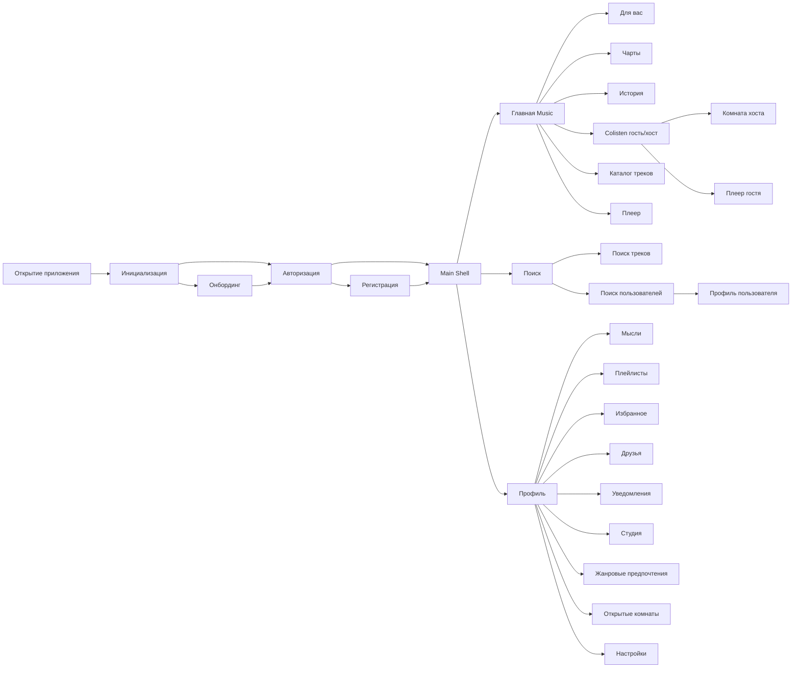

# User-flow MiMusic

Диаграмма для вставки в пояснительную записку (рисунок 3.9 или следующий свободный номер).
Можно отрисовать в draw.io / Figma по схеме ниже или экспортировать Mermaid: https://mermaid.live

## Mermaid (дерево слева направо)



## Текстовая схема (как в примере Englio)

```
[Открытие приложения]
        |
[Инициализация] — настройки, уведомления, AudioService
        |
   +----+----+----+
   |    |    |    |
[Онбординг] [Вход] [Регистрация + инвайт]
   |         \    /
        [Main Shell — нижняя навигация]
   +--------+--------+
   |        |        |
[Главная] [Поиск] [Профиль]
   |        |        |
   |        |        +— Мысли, Плейлисты, Избранное, Друзья
   |        |        +— Уведомления, Студия, Жанровые предпочтения
   |        |        +— Открытые комнаты, Настройки
   |        |
   |        +— Поиск треков / релизов
   |        +— Поиск пользователей → публичный профиль
   |
   +— Для вас, Чарты, История
   +— Совместное прослушивание (Colisten)
   +— Каталог треков, релизы
   +— Мини-плеер / полноэкранный плеер
```
